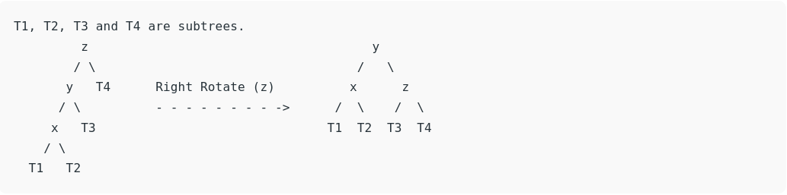
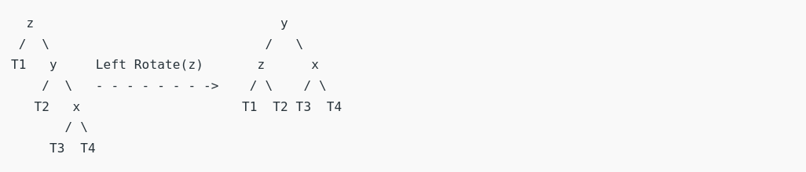
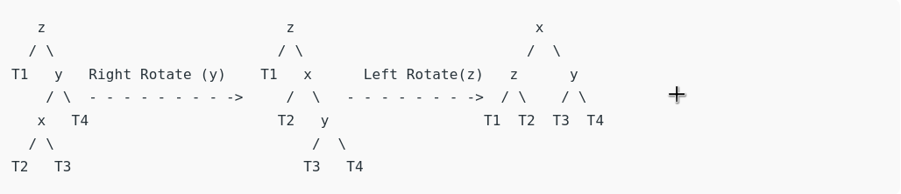
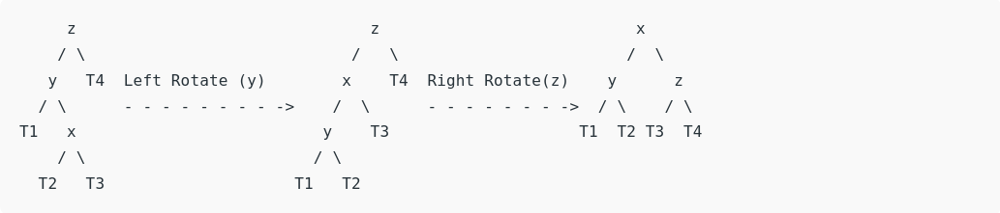

# AVL Tree Lib

## brief

AVL Tree Lib is modern C++ implementation of AVL self balancing search tree algorithm.

## Building

``` bash
git clone https://github.com/konstantin89/avl-tree-lib
cd avl-tree-lib
cd build
conan install ..
conan build ..
```

## AVL Trees Theory

### Right rotation


### Left rotation


### Right Left rotation


### Left Right rotation

